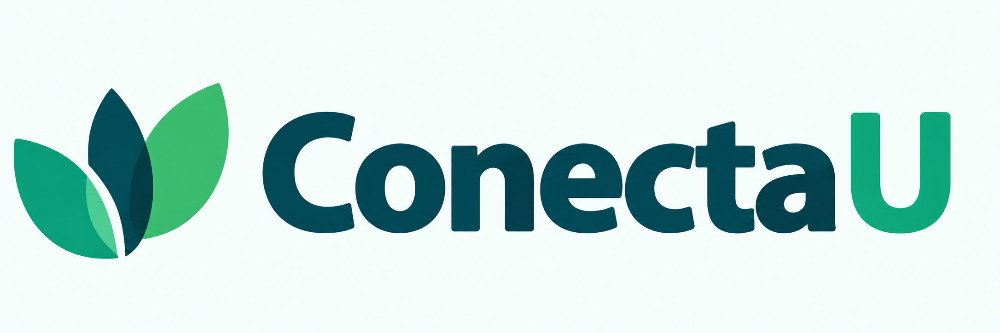
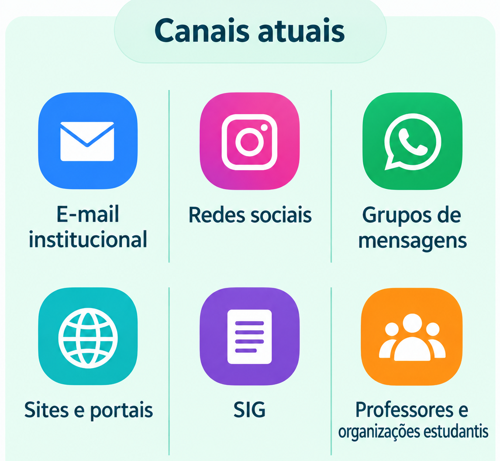
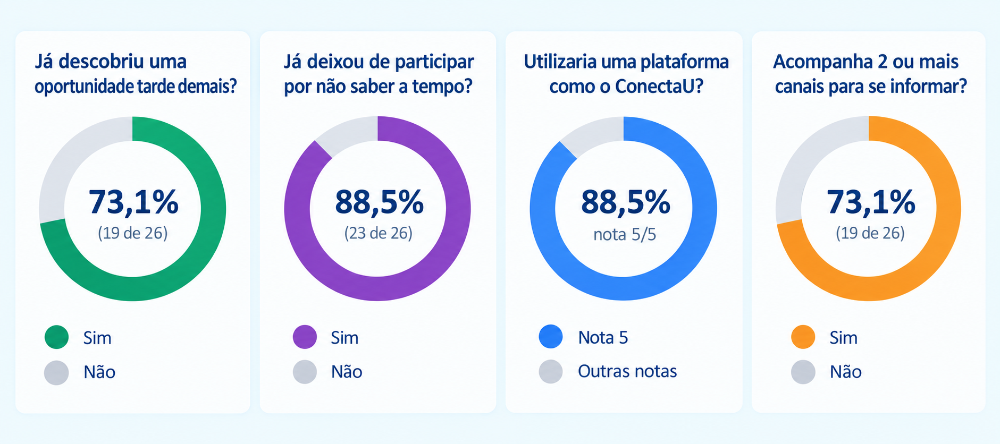
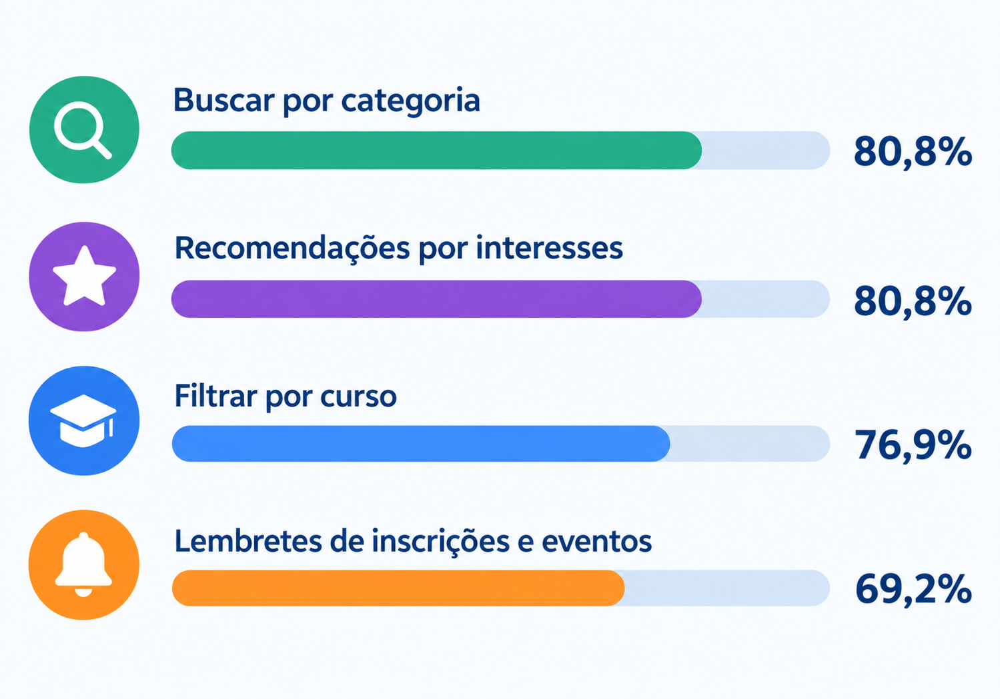
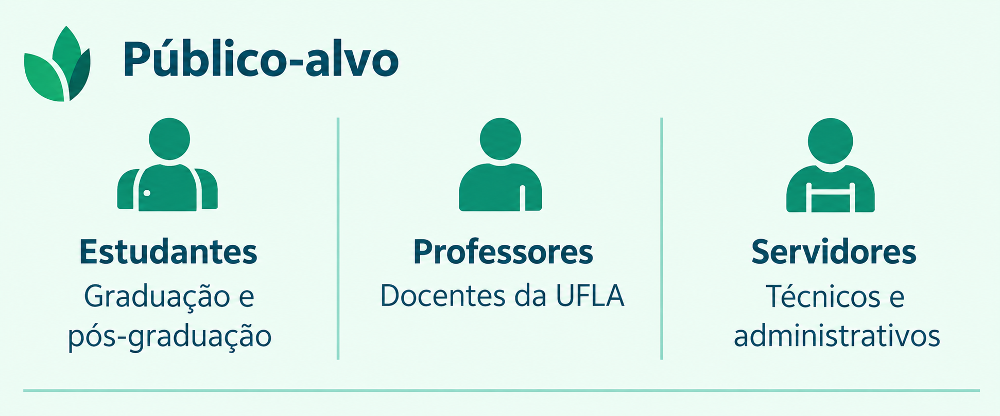
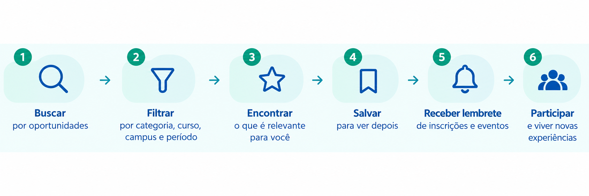

# 🌱 ConectaU
### Descubra, participe, conecte-se.

  

> **O problema não é a falta de oportunidades na UFLA.
> É o custo de descobri-las a tempo e encontrar as que realmente são
> relevantes para cada pessoa.**

---

## 📌 Sobre o ConectaU

O **ConectaU** é uma plataforma web que reúne e personaliza
oportunidades da UFLA, como eventos, atividades, bolsas, projetos
e processos seletivos.

A proposta é facilitar a descoberta dessas oportunidades,
funcionando como uma **camada complementar aos canais oficiais
da universidade**.

---

## ❗ O problema

A UFLA oferece e divulga diversas oportunidades para sua comunidade
universitária.

O desafio está em fazer **a oportunidade certa chegar à pessoa certa,
no momento certo**.

Atualmente, essas informações podem estar distribuídas entre
diferentes canais:

  

**E-mail institucional · Redes sociais · Grupos de mensagens ·
Sites e portais · SIG · Professores · Organizações estudantis**

Essa dispersão exige que cada pessoa acompanhe diferentes fontes e
identifique, entre muitas informações, aquilo que é relevante para
seu perfil.

Como consequência, uma oportunidade pode ser descoberta tarde demais
ou nem chegar ao conhecimento de quem poderia participar.

---

## 📚 Motivação e evidências

Estudos sobre comunicação no ensino superior indicam que estudantes
recebem informações por diferentes canais e que aspectos como
**relevância, preferências e excesso de mensagens** influenciam a
forma como essas informações são percebidas.

Além disso, pesquisas relacionam a participação em atividades
extracurriculares e o sentimento de pertencimento à experiência e a
diferentes resultados acadêmicos dos estudantes.

Essas evidências, juntamente com uma pesquisa exploratória realizada
com membros da comunidade da UFLA, ajudaram a fundamentar o problema
abordado pelo ConectaU.

---

## 📊 Pesquisa exploratória

Para realizar uma validação inicial do problema dentro da comunidade
da UFLA, foi elaborado um formulário sobre a descoberta de eventos,
projetos, bolsas, processos seletivos e outras oportunidades.

A pesquisa recebeu **26 respostas**.

Os resultados apontam para dificuldades relacionadas à descoberta
oportuna de oportunidades e indicam interesse em recursos que
facilitem sua busca e organização.

  

### Recursos considerados úteis

  

Entre os participantes que relataram ter descoberto oportunidades
tarde demais, o motivo mais frequente foi ter tomado conhecimento
**após o encerramento das inscrições**.

> **Importante:** a pesquisa possui caráter exploratório e não tem como
> objetivo representar estatisticamente toda a comunidade da UFLA.

---

## 👥 Público-alvo

O ConectaU é destinado à comunidade universitária, incluindo:

  

A proposta contempla inicialmente os campi de **Lavras/MG** e
**São Sebastião do Paraíso/MG**.

---

## 💡 Proposta de solução

O ConectaU propõe uma plataforma que reúne oportunidades em um único
ambiente e permite que cada usuário encontre aquilo que é mais
relevante para seu perfil.

  

O fluxo permite que o usuário encontre, filtre e acompanhe
oportunidades relevantes até o momento da participação.

O ConectaU **não substitui os canais oficiais da UFLA**.

A proposta é atuar como uma **camada complementar de descoberta e
organização**, facilitando o acesso às informações que já são
divulgadas pela universidade e por sua comunidade.

---

## 🎯 Impacto social esperado

O impacto esperado está relacionado principalmente à ampliação do
acesso às oportunidades e ao estímulo à participação da comunidade.

<!-- 

  

-->

Espera-se contribuir para:

- ampliar o acesso às oportunidades;
- facilitar a descoberta de atividades relevantes;
- estimular a participação da comunidade;
- aproximar estudantes, professores e servidores;
- fortalecer a integração entre cursos, áreas e campi.

### 📈 Como medir o impacto

O impacto poderá ser acompanhado por indicadores como:

- quantidade de oportunidades cadastradas;
- quantidade de oportunidades visualizadas;
- quantidade de usuários participantes;
- quantidade de oportunidades salvas;
- distribuição de oportunidades visualizadas entre cursos e campi;
- participação originada a partir da plataforma;
- redução de relatos de descoberta tardia;
- percepção dos usuários sobre a facilidade de encontrar oportunidades.

---

## 🧪 Exemplo de uso

Imagine um estudante interessado em **pesquisa e tecnologia**.

Em vez de acompanhar diversos canais separadamente, ele acessa o
ConectaU e encontra oportunidades relacionadas aos seus interesses.

Ele pode filtrar as oportunidades, salvar aquelas que considera
relevantes e acompanhar seus prazos.

Assim, uma oportunidade que poderia passar despercebida pode ser
encontrada pelo estudante no momento adequado.

---

## 🆔 Identidade da startup

**Nome:** ConectaU

**Slogan:** *Descubra, participe, conecte-se.*

### Proposta de valor

> **Uma plataforma que reúne e personaliza oportunidades da UFLA para
> que cada membro da comunidade encontre o que é relevante para ele
> antes que o prazo acabe.**

---

## 👨‍💻 Equipe

| Integrante | Função |
|---|---|
| **Guilherme Alexandre Cunha Silva** | Scrum Master |
| **Gustavo de Assis Vieira** | Desenvolvedor |
| **João Vitor Givisiez Lessa** | Desenvolvedor |
| **Maria Luiza Santos Ferreira** | Product Owner |

---

## 📚 Referências

1. **GILANI, David.** *Student attitudes and preferences towards
   communications from their university – a meta-analysis of student
   communications research within UK higher education institutions.*
   Journal of Higher Education Policy and Management, v. 46, n. 3,
   p. 274–290, 2024.  
   DOI: 10.1080/1360080X.2024.2344234.

2. **SIMPSON, Judith; BRANAGAN, Caitlin; LAU CHENG VON, Vonnie;
   WILLIAMS, Lily.** *Spamming our students? The use of email as a
   mass communication tool in higher education.*
   Journal of Further and Higher Education, p. 152–159, 2025.  
   DOI: 10.1080/13603108.2024.2440705.

3. **KULP, Amanda M.; PASCALE, Amanda Blakewood; GRANDSTAFF,
   Matthew.** *Types of Extracurricular Campus Activities and
   First-Year Students’ Academic Success.*
   Journal of College Student Retention: Research, Theory & Practice,
   v. 23, n. 3, p. 747–767, 2021.  
   DOI: 10.1177/1521025119876249.

4. **VAN KESSEL, Gisela et al.** *Relationship between university
   belonging and student outcomes: A systematic review and
   meta-analysis.* The Australian Educational Researcher, v. 52,
   p. 2511–2534, 2025.  
   DOI: 10.1007/s13384-025-00822-8.

5. **UNIVERSIDADE FEDERAL DE LAVRAS (UFLA).**
   *Divulgação de eventos.* Catálogo de Serviços da UFLA.
